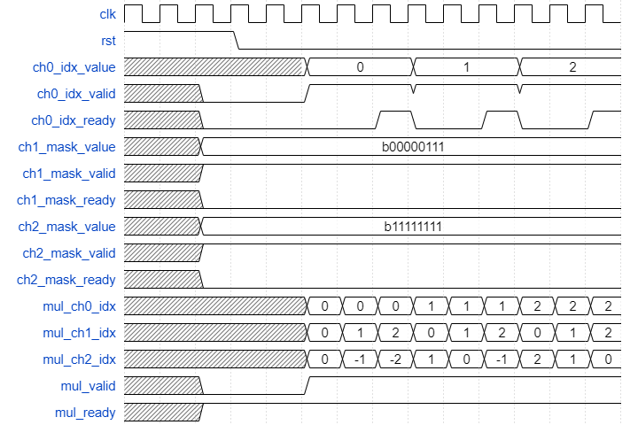

NonZeroMulDetector
===================

## 1.功能描述
根据ch0 offset、ch1 mask、ch2 mask选择出要执行的乘法。其中，ch0 offset为乘法第一个操作数在向量中的偏移量，ch1 mask标明了第二个操作数的非零情况，ch2 mask为输出数据的非零情况。

## 
  
## 2.顶层接口信号

parameter N:ch0 idx位宽 \
parameter M:ch1 mask位宽，代表ch1最长向量长度
parameter P:ch2 mask位宽，代表ch2最长向量长度

| Signal | Num of Bits | I/O | Description |
|--------|-------------|-----|-------------|
| ch0_idx_value |    N     | in | ch0数据在组内的偏移|
| ch0_idx_valid |    1     | in | ch0_idx有效|
| ch0_idx_ready |    1     | out| ch0_idx已被模块接收|
| ch1_mask_value|    M     | in | ch1向量非0情况  |
| ch1_mask_valid|    1     | in | ch1_mask有效|
| ch1_mask_ready| 1 | out | ch1_mask已被模块接收|
| ch2_mask_value|    P     | in | ch2向量非0情况  |
| ch2_mask_valid| 1 | in | ch2_mask有效|
| ch2_mask_ready| 1 | out | ch2_mask已被模块接收|
| mul_ch0_idx   | N | out | 非0乘法中，第一个操作数在ch0向量中的索引 |
| mul_ch1_idx   | log2(M)| out | 非0乘法中，第二个操作数在ch1向量中的索引 |
| mul_ch2_idx   | log2(P)| out | 非0乘法中，输出在输出向量中的索引 |
| mul_valid   | 1 | out |非0乘法中，第二个操作数在ch1向量中的索引 |
| mul_ready   | 1 | in  |非0乘法中，输出在输出向量中的索引 |

## 3.顶层接口信号时序

