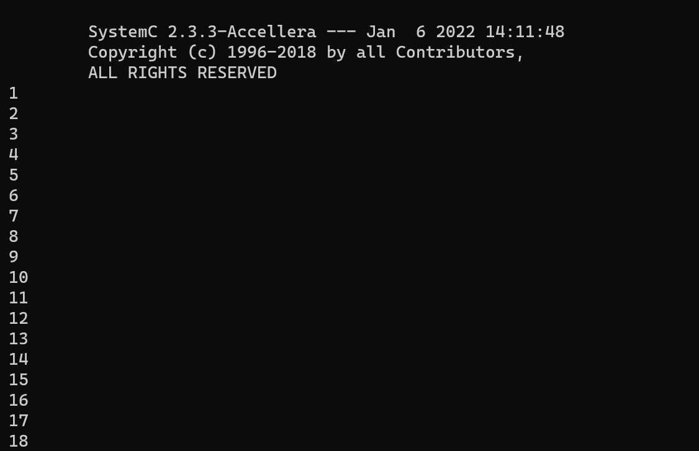

## SystemC安装

### 安装环境
以下安装均在linux下进行，建议使用Ubuntu系统进行安装

### 下载安装包
下载链接：https://accellera.org/images/downloads/standards/systemc/systemc-2.3.3.tar.gz

### 解压安装包并编译安装
```bash
tar -zxvf systemc-2.3.3.tar.gz
cd systemc-2.3.3
./configure --prefix=/usr/local
make
sudo make install
```

### 将systemc的include、lib文件添加到系统环境变量中
```bash
echo "export LD_LIBRARY_PATH=/usr/local/lib-linux64:\$LD_LIBRARY_PATH 
export LIBRARY_PATH=/usr/local/lib-linux64:\$LIBRARY_PATH 
" >> ~/.bashrc
source ~/.bashrc
```

## systemc建模及测试

### 编写systemc模型
下面以一个counter计数器为例,编写一个systemc模型

创建counter.cpp文件，并以下代码
```cpp
#include <systemc.h>

SC_MODULE( counter ){

	sc_in_clk clk;
	sc_in<bool> rst;
	sc_out<unsigned int> cnt;

	void count(){

		while(true){
			if(rst){
				cnt = 0;
			}else{
				cnt = cnt + 1;
			}
			wait();
		}
	}

	SC_CTOR(counter){
		//SC_METHOD( count );
		SC_THREAD( count );
		sensitive_pos( clk );
	};

};
```

更详细的systemc具体方法可参见[书籍](./SystemC片上系统设计.pdf)

### 编写systemc测试程序

创建counter_tb.cpp文件，并以下代码
```cpp
#include <systemc.h>
#include "counter.cpp"

int sc_main(int argc, char** argv){

	sc_clock clk( "clk" , 10 , SC_NS , 0.5 , 3 , SC_NS, true );
	sc_signal<bool> reset;
	sc_signal<unsigned int> counter_out;

	counter top("counter") ; 
	top.clk( clk );
	top.rst(reset);
	top.cnt( counter_out);

	//reset
	reset = 1;
	for( int i = 0; i<100;i++){
		sc_start(10,SC_NS);
	}
	reset = 0;

	//read counter
	for( int i = 0; i<100;i++){
		sc_start(10,SC_NS);	
		cout << counter_out << endl;
	}

	return 0;
}

```

## 编译程序并运行测试程序
```bash
g++ -lsystemc counter_tb.cpp -o counter_tb.out
./counter_tb.out
```

运行结果如下图所示：

